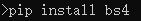

# TsunamiDataDownload
A SJTU PRP project, which can download tsunami caused by earthquake data by a button.  

## Version

### V0.1 (2018.5.12)

### V0.3 (2018.8.28)

## Install

### Windows

#### 0.Make sure you have installed python3.x(3.6 is recommanded) and pip3 and some necessary library.

You can check it like this. 
  
Install from https://www.python.org/ 
And make sure you have these package.(Version is just for recommendation) 
  
You can follow the instructions bellow to install them.

#### 1.	Press Win+R together and enter cmd.

  

#### 2.	Install packages

Enter pip install requests just as the following picture shows.

 

If the installation is successful, it will show as follows.
 
 

Similarly, enter pip install numpy.
  

 

The installation of the next three ones are all similar. 
  

  

  

#### 3.	Install an important package called basemap

Go to *http://www.lfd.uci.edu/~gohlke/pythonlibs/*.
On the page, press CTRL +F and enter basemap and pyproj for quick positioning.  There are several versions, and you need to choose one of them. 32 and 64 on win refer to the Python version installed, and the Numbers behind cp refer to the Python version. 
  
  
Download one of them to a file. Next, you need change directory to the file and enter pip install xxx(xxx is the name of .whl you have downloaded)
For example, I download basemap-1.1.0-cp36-cp36m-win32.whl, and I put it in the directory E:\JI\prp\p1. So I need to enter the following things in cmd.
  

#### 4.Install another two packages

 

### Note:

Please shut down the anti-virus software(especially 360) when you run the program.
 
 

## Update Information(until 2018.8.28)
### 2018.03.07 Deng
Creat this project and upload:  
1. settings.py(for Input index) 
2. GetUsgsData.py(for get earthquake information and save it in ./cache/earthquake.csv) 
3. UpdateDartStation.py(for get all Dart stations' information and save them in ./cache/DartStationRecord) 
4. PRP_GUI.py(Demo GUI)
### 2018.03.09 Deng
Upload: 
1. earthquake.py(a class for earthquake) 
2. GetDartData(for get a certain Dart station data when a certain earthquake happened and calculate the relative time from the earthquake and the water height) 
3. ./cashe(for Professor to check if the modules do things correctly) 
fixed: 
1. README.md(for better record the update information)
### 2018.03.23 Zhou
Upload: 
1. ChooseDartStation.py(choose for five stations nearest to the earthquake.epi) 
### 2018.03.23 Deng
Upload: 
1. RemoveTidesPolynomialFit.py(Signal process part using polynomial fit) 
2. main.py(just run it and get the result)[partly finished] 
fixed: 
1. README.md 
2. bug fixed 
3. add two interesting result pictures(I believe DartData_52402.jpg is a Tsunami I catch for the earthquake at 2018-02-25T17:44:43.920Z)
### 2018.03.27 Deng
Fixed: 
1. Common line UI. 
2. File system 
3. Dpi of picture generated by matplotlib  
4. Bunch of bugs(bug 9999.000)
### 2018.04.01 Zhou
Fixed: 
1. UpdateDartStation.py(make it able to decide whether we need to update the station list) 
### 2018.04.01 Deng
Upload: 
1. RemoveTidesFilter.py(used to remove the tides by high-pass filter) 
Fixed:(main.py/RemoveTidesPolynomialFit.py) 
2. filesystem optimize 
3. bug fixed 
4. detailed information are added 
### 2018.05.12 Deng
All project has been pushed. 
Version 0.1
### 2018.08.28 Deng
Huge amount of Bug Fixed 
Version 0.3
## Future
1. Fix bugs
2. Manual edit

